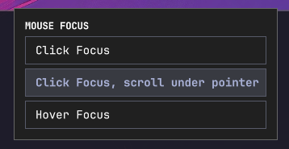

# Omarchy Mouse Focus

`jlord.mouse-focus` is an Omarchy bar widget for selecting Hyprland's
`input:follow_mouse` behavior. Left-click the target icon to open a window with
one button for each mode. Right-click does nothing. The current
mode is shown as the selected/pressed button; clicking another button applies
it immediately.



## Modes

- `Click Focus` (`follow_mouse = 0`): cursor movement will not change focus.
- `Click Focus, scroll under pointer` (`follow_mouse = 2`): cursor focus is detached from keyboard focus. Clicking on a window moves keyboard focus to that window.
- `Hover Focus` (`follow_mouse = 1`): cursor movement always changes focus to the window under the cursor.

## Installation

Run:

```bash
./install.sh
```

Then add this widget before the clock in the center section of
`~/.config/omarchy/shell.json`:

```json
{
  "id": "jlord.mouse-focus"
}
```

The installer copies the plugin to `~/.config/omarchy/plugins/` and installs
the managed Hyprland module at `~/.config/hypr/mouse-focus.lua`.

The user's `~/.config/hypr/input.lua` must load the module:

```lua
require("hypr.mouse-focus")
```

## Uninstallation

Run:

```bash
./uninstall.sh
```

Also remove the widget entry from `~/.config/omarchy/shell.json`. The uninstall
script does not edit that file automatically.

## Development

The active installed copy is separate from this repository. After editing the
repository copy, rerun `./install.sh` to copy it into the Omarchy plugin
directory.
